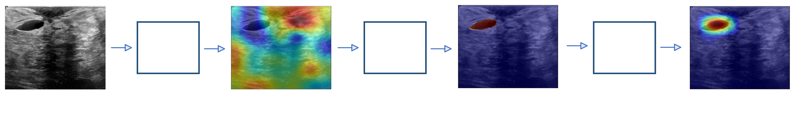

# Visual-Steering-For-Deep-Neural-Networks

## Abstract
This repository contains the source code to visually steer the CNN models into alligning with the human knowledge fed into them.  This method is provided for integrating human knowledge with the convolutional neural network to improve its performance, reduce the biases that arise, and leverage human experience.

## Methodology

The proposed approach is divided into 3 stages: explaining the model, manually editing the attention maps, and embedding human knowledge using a specific loss. First, Grad-CAM was used to generate attention maps describing the importance values of each image region according to the model to make a specific decision. These attention maps were then annotated by domain experts to represent what they believed were the image regions important to make that decision. Finally, the annotated attention maps were used to steer the model into aligning its behaviour with the human behaviour hence, embedding the human knowledge into the learning process of the model.

## Enviroment

## Execution

## Datasets
We applied this approach on 3 datasets:
Imagenette2
Breast Cancer Ultrasound Images (BUSI)
International Skin Imaging Collaboration (ISIC)

## Models
We applied this approach on several models from the ResNet family:
ResNet50
ResNet101
ResNet152

